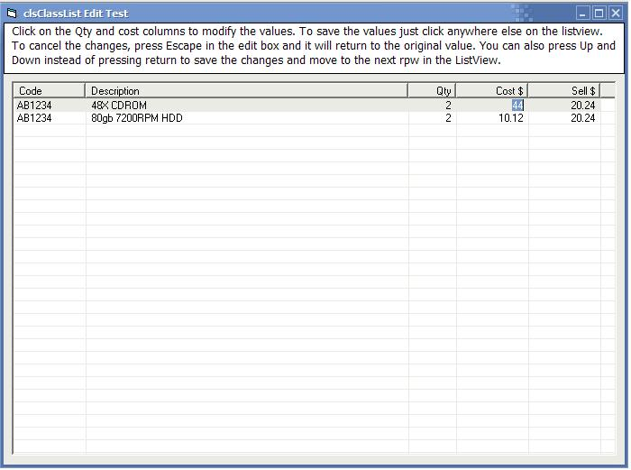



## ListView Cell Editor

### Description

Allows you to customise your ListView controls so to allow specific columns to be editied by clicking on them and resized whenever your ListView changes its dimensions.
 
### More Info
 
This class doesn't yet support listviews that have columns that are accessed with a horizontal scroll bar.

             |
---                |---
**Submitted On**   |2003-12-17 09:49:14
**By**             |[Aaron Thorp](https://github.com/Planet-Source-Code/PSCIndex/blob/master/ByAuthor/aaron-thorp.md)
**Level**          |Intermediate
**User Rating**    |4.5 (27 globes from 6 users)
**Compatibility**  |VB 5\.0, VB 6\.0
**Category**       |[Custom Controls/ Forms/  Menus](https://github.com/Planet-Source-Code/PSCIndex/blob/master/ByCategory/custom-controls-forms-menus__1-4.md)
**World**          |[Visual Basic](https://github.com/Planet-Source-Code/PSCIndex/blob/master/ByWorld/visual-basic.md)
**Archive File**   |[ListView\_C169014142004\.zip](https://github.com/Planet-Source-Code/aaron-thorp-listview-cell-editor__1-50769/archive/master.zip)

